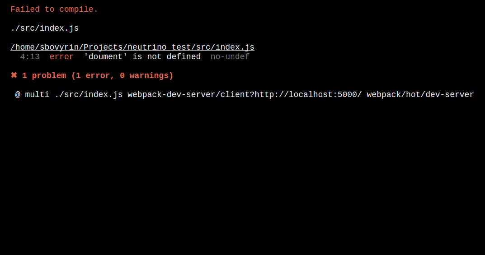

# neutrino-preset-dev-errors


## What is it?
Neutrino preset to output error on the browser window



## How to use?

```
// package.json
{
  ...
  "config": {
    "presets": [
      "neutrino-preset-web",
      "neutrino-preset-dev-errors"
    ]
  }
  ...
}
```

